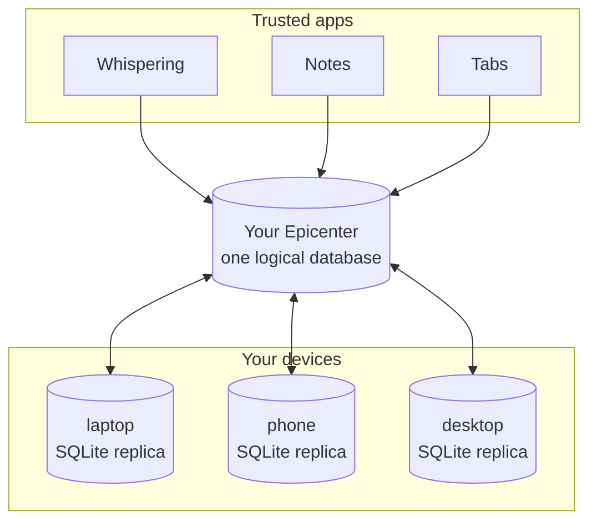

<p align="center">
  <a href="https://epicenter.so">
    
  </a>
  <h1 align="center">Epicenter</h1>
  <p align="center"><strong>What if you could manage your entire digital life in one SQLite database?</strong></p>
  <p align="center">Epicenter is a collection of local-first apps built around a simple inversion: the database belongs to the person, not the application.</p>
  <p align="center">Your notes, settings, documents, conversations, and history stay together on your devices. Each app gives you a different way to work with the same underlying data.</p>
  <p align="center">Start with <a href="https://whispering.epicenter.so">Whispering in the browser</a>, or run it as a native surface inside <a href="apps/epicenter">Epicenter</a>.</p>
</p>

<p align="center">
  <a href="https://github.com/EpicenterHQ/epicenter" target="_blank">
    
  </a>
  <a href="#license">
    
  </a>
  <a href="#license">
    
  </a>
  <a href="https://go.epicenter.so/discord" target="_blank">
    
  </a>
</p>

<p align="center">
  <a href="#one-person-one-epicenter">The Model</a> |
  <a href="#what-were-building">Status</a> |
  <a href="#whispering">Whispering</a> |
  <a href="#apps">Apps</a> |
  <a href="#build-with-the-toolkit">Toolkit</a> |
  <a href="#trust-boundaries">Trust</a> |
  <a href="#development">Development</a> |
  <a href="#license">License</a>
</p>

---

## One person. One Epicenter.

The conventional model is one database per app, run by the vendor. Every app
you adopt opens another silo. Every app you abandon strands another slice of
your life: the notes in one company's cloud, the transcripts in another's, the
history gone when a startup folds.

Epicenter is built on the opposite premise. One person owns one logical
database: their Epicenter. Each device keeps a full SQLite replica of it, with
media and attachments beside it as ordinary files. Apps don't bring their own
databases; they bring typed views over yours.



Because everything lives in one place you control, you get properties no
per-app cloud can offer:

- **Yours to inspect.** It's SQLite. Open your own database read-only and
  query it with plain SQL; take a complete portable export whenever you want.
- **Yours to keep.** Apps may change or disappear. Your work, memory, and
  accumulated context stay useful, because they never lived inside the app.
- **More private, more personal.** Data stays on your devices instead of
  scattering across vendor clouds, and each app can build on the context the
  others created: transcripts inform notes, saved tabs become drafts, an
  assistant sees the whole picture without an integration per app.

Sync, when you turn it on, runs through your account's server: hosted
Epicenter if you want convenience, self-hosted if you want the server in your
own hands.

The bet underneath all of it: the person, not the vendor, should be the
permanent center of their digital life.

## What we're building

That model is the accepted destination, and this section is the honest line
between it and today.

Shipped now:

- **Whispering**, in the browser and as a native surface inside the Epicenter
  desktop host.
- **Epicenter**, the Tauri desktop host that serves trusted app surfaces.
- **Matter**, a standalone typed grid over folders of Markdown you own.
- The **hosted API** and a community-supported **self-host reference**.

In progress:

- The one-database architecture above is decided and recorded (Proposed ADRs
  0160 through 0182 and the one-Epicenter clean-break spec in this repo), but
  the shipped data layer still organizes storage into per-app workspaces keyed
  by ID. The migration deletes that second identity wave by wave.
- Read-only live SQL over one stable `rows` relation and the portable
  `.epicenter` export are part of that migration, not shipped behavior yet.

Until those waves land, read the model section as direction. The current
truth: local-first storage and sync work today through `@epicenter/workspace`;
"one SQLite database per person" is what it is converging to, in the open, in
this repo.

## Whispering

[Whispering](apps/whispering) is a speech-to-text SPA with two hosts. Open the [hosted browser app](https://whispering.epicenter.so), or run the same source as a native surface inside [Epicenter](apps/epicenter).

Press record, speak, optionally transform the transcript, and copy or deliver the result. Both hosts support cloud providers and self-hosted endpoints. Epicenter adds system-global shortcuts, native paste delivery, and local GGUF transcription.

[Open Whispering](https://whispering.epicenter.so) | [Read the app architecture](apps/whispering)

## Apps

| Surface | Status | Notes |
| --- | --- | --- |
| [Whispering](apps/whispering) | Browser and Epicenter surface | One speech-to-text SPA with browser-safe providers and Epicenter-only native capabilities. |
| [Epicenter](apps/epicenter) | Desktop host | The only Tauri runtime. Serves trusted app surfaces, including Whispering, under one native shell. |
| [Matter](apps/matter) | WIP product work | Typed grid for user-owned Markdown folders. It edits ordinary `.md` files directly; `matter.sqlite` is a disposable query mirror. |
| [API](apps/api) | Hosted infrastructure | Personal cloud Worker for hosted Epicenter services. Includes hosted-only billing and dashboard code. |
| [Self-host](apps/self-host) | Reference deployable | Community-supported single-partition instance without hosted billing. |
| Other app folders | Research and prototypes | Useful history and experiments, not the current product lineup. |

## Build With The Toolkit

The developer toolkit is MIT: build anything on it, including closed-source and commercial products, and you own what you build, with no obligation back to Epicenter. These are the packages meant to leave this repo: [`@epicenter/workspace`](packages/workspace), [`@epicenter/ui`](packages/ui), [`@epicenter/filesystem`](packages/filesystem), and [`@epicenter/sync`](packages/sync). They are pre-1.0 and tuned for our own apps, so treat them as fork-and-own rather than a stability-guaranteed SDK for now.

The hard problem with local-first apps is synchronization. If each device has
its own SQLite file, how do you keep them in sync?
[`@epicenter/workspace`](packages/workspace) answers with two planes: bounded
JSON rows live directly in runtime-native SQLite, while each row may own a
lazy Yjs 14 document for collaborative rich content. SQLite is the queryable
scalar source, not a mirror of one giant in-memory document.

| Package | Role | License |
| --- | --- | --- |
| [`@epicenter/workspace`](packages/workspace) | Typed data API, queryable scalar replicas, lazy row documents, local persistence, actions, and runtime composition. | MIT |
| [`@epicenter/row-sync`](packages/row-sync) | Portable scalar row protocol, admission, deterministic field folding, and exact-retry digests. It owns no authority database. | MIT |
| [`@epicenter/sqlite`](packages/sqlite) | Neutral embedded-SQLite driver and Browser, Bun, and Durable Object adapters. It owns no product schema. | MIT |
| [`@epicenter/sync`](packages/sync) | Yjs document protocol encoding and provider behavior, separate from scalar row synchronization. | MIT |
| [`@epicenter/ui`](packages/ui) | Shared Svelte component library used by multiple app surfaces. | MIT |
| [`@epicenter/filesystem`](packages/filesystem) | POSIX-style virtual filesystem helpers over workspace data. | MIT |
| [`@epicenter/server`](packages/server) | Shared Hono server library composed by the hosted API and self-host reference deployable. | AGPL-3.0-or-later |
| [`@epicenter/cli`](packages/cli) | The `epicenter` command and local or hosted API workflows. | AGPL-3.0-or-later |

[Read the workspace package docs](packages/workspace/README.md)

## Trust Boundaries

Pick the trust model you want.

| Path | What leaves your device |
| --- | --- |
| Whispering in Epicenter with local GGUF transcription | Audio stays on your device. Transcripts and settings use Epicenter's local desktop storage. |
| Whispering with a cloud transcription provider | Audio goes from your device to the provider you choose. Epicenter servers are not in that transcription path. |
| Whispering transformations | Transcript text goes to the LLM provider you choose when you enable that step. |
| Hosted Epicenter API or sync | Synchronized data, account/session data, and enabled hosted feature requests go to Epicenter servers. |
| Self-hosted deployable | You control the server, secrets, deployment, and infrastructure boundary. |

Signed-in sync sends your updates to a trusted relay that reads them in plaintext. On hosted Epicenter the relay is ours, so that data sits inside our trust boundary; self-hosting puts the relay on infrastructure you control, so Epicenter never holds it. See the [trust model](docs/trust-model.md) for the details.

The detailed privacy notes for Whispering live in [apps/whispering](apps/whispering).

## Architecture

The server side is split into one shared library and two deployable folders:

```txt
packages/server
  shared Hono library
  route composition for auth, sessions, rooms, assets, and provider-backed APIs

apps/api
  hosted personal Cloudflare Worker
  composes packages/server with a Better Auth principal resolver
  owns hosted-only dashboard and billing code

apps/self-host
  self-hosted single-partition instance reference deployable
  composes packages/server with the instance principal resolver
  community-supported
  no hosted billing surface
```

[Full architecture walkthrough](docs/architecture.md) | [Trust model](docs/trust-model.md)

## Development

Use Bun in this repo.

```bash
git clone https://github.com/EpicenterHQ/epicenter.git
cd epicenter
bun install
```

Every app starts from the repo root. `bun dev:<app>` runs every process the app needs; for apps that talk to the hosted API, that includes the API worker on `localhost:8787`. `bun dev:<app>:ui` runs the app's frontend alone when that split exists, and `bun dev:api` runs just the backend. Bare `bun dev` is the current default workflow (API and Tab Manager), and `bun run` with no arguments lists every target.

| Command | Starts | App port |
| --- | --- | --- |
| `bun dev:api` | Hosted API worker alone | 8787 |
| `bun dev:api-dashboard` | API + dashboard UI | 5178 |
| `bun dev:honeycrisp` | API + Honeycrisp desktop | 5175 |
| `bun dev:opensidian` | API + Opensidian | 5176 |
| `bun dev:tab-manager` | API + Tab Manager extension | extension build |
| `bun dev:vocab` | API + Vocab | 8888 |
| `bun dev:whispering` | API + hosted Whispering browser app | 1420 |
| `bun dev:epicenter` | Epicenter desktop host, including Whispering | Tauri window |
| `bun dev:landing` | Landing site, standalone | 4321 |
| `bun dev:matter` | Matter desktop, standalone | 5180 |
| `bun dev:posthog-reverse-proxy` | PostHog reverse proxy Worker | wrangler default |
| `bun dev:self-host` | Self-host server (needs `INSTANCE_TOKEN`) | 8787 |
| `bun dev:skills` | Skills editor, standalone | vite default |
| `bun dev:todos` | Todos, standalone | 5177 |

The API needs local Postgres and Infisical; see [apps/api/README.md](apps/api/README.md). Rust is needed for Tauri apps such as Epicenter, Matter, and Honeycrisp. Local Books and Local Mail run their own multi-process dev flows; their READMEs document them.

Useful checks:

```bash
bun run typecheck
bun run test
bun run check
```

## Design Notes

Durable decisions live in [docs/adr/](docs/adr); shared vocabulary in [docs/CONTEXT.md](docs/CONTEXT.md); in-flight implementation specs in [specs/](specs). Start with [docs/README.md](docs/README.md).

## Contributing

Contributions are welcome. Good entry points are docs, Whispering fixes, local-first infrastructure, Svelte interfaces, and small changes that make the repo easier to understand.

[Read the Contributing Guide](CONTRIBUTING.md)

Contributors coordinate in [Discord](https://go.epicenter.so/discord).

## License

Epicenter uses a two-tier split by how you use the code:

- [MIT](licenses/LICENSE-MIT) for code you build with: the toolkit roots (`@epicenter/workspace`, `@epicenter/ui`, `@epicenter/filesystem`, `@epicenter/sync`) and the toolkit-internal contracts they carry (`@epicenter/identity`, `@epicenter/agent-protocol`, `@epicenter/encryption`, `@epicenter/field`, `@epicenter/chat`). Nine packages today.
- [AGPL-3.0](licenses/LICENSE-AGPL-3.0) or later for code we ship or run: every app, the shared server library, the CLI, and the rest of the internal packages.
- There is no proprietary tier today. Revenue is intended to come from hosting and services, not from selling closed licenses.

Every dependency of the toolkit packages is MIT-compatible, enforced by `bun run check:licenses`. The license split follows the same broad pattern as Plausible and PostHog for hosted open-source services, and Yjs for MIT core libraries with copyleft server pieces.

See the root [LICENSE](LICENSE), [FINANCIAL_SUSTAINABILITY.md](FINANCIAL_SUSTAINABILITY.md), and the [licensing strategy](docs/licensing/licensing-strategy.md) for the full model.

---

<p align="center">
  <strong>Contact:</strong> <a href="mailto:github@bradenwong.com">github@bradenwong.com</a> | <a href="https://go.epicenter.so/discord">Discord</a> | <a href="https://twitter.com/braden_wong_">@braden_wong_</a>
</p>

<p align="center">
  <sub>One person. One Epicenter. Local-first, open source.</sub>
</p>
