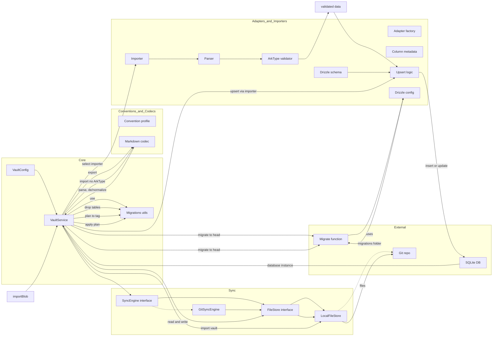

# Vault Core: architecture and adapter relationships (new)

Purpose: explain core functionality, how adapters plug in, and how data flows at runtime. Snapshot of the current VaultService-centric design.

Quick links

- [src/index.ts](/packages/vault-core/src/index.ts)
- [src/core/index.ts](/packages/vault-core/src/core/index.ts)
- [src/adapters/index.ts](/packages/vault-core/src/adapters/index.ts)

Core surfaces

- VaultService orchestrator
  - Class: [VaultService](/packages/vault-core/src/core/vault-service.ts)
  - Blob import: `importBlob(blob, importerId)` (ArkType validation ON)
  - Filesystem export/import: `export(importerId, store)`, `import(importerId, store)` (no ArkType)
  - Migration orchestration: `migrateImportMigrate(importerId, store, { targetTag })`
  - Optional Git helpers via SyncEngine: `gitPull()`, `gitCommit(msg)`, `gitPush()`
- Vault configuration
  - Interface: [VaultServiceConfig](/packages/vault-core/src/core/config.ts)
  - Caller supplies: Drizzle DB ([CompatibleDB](/packages/vault-core/src/core/adapter.ts)), `migrateFunc`, optional `syncEngine`, a single Markdown `codec`, and a convention profile
- Conventions & Codec
  - Convention is part of [codec.ts](/packages/vault-core/src/core/codec.ts) via `defaultConvention()`
  - Codec: [markdown](/packages/vault-core/src/codecs/markdown.ts)
- Sync Engine
  - Interface: [SyncEngine](/packages/vault-core/src/core/sync.ts)
  - Git implementation: [GitSyncEngine](/packages/vault-core/src/sync/git.ts)
  - File store: [LocalFileStore](/packages/vault-core/src/fs/local-file-store.ts)
- Migrations utilities
  - Module: [migrations.ts](/packages/vault-core/src/core/migrations.ts)
  - Reads drizzle journal, plans SQL, drops adapter tables, applies steps (DB-specific TODOs called out)
 

Concrete adapter example: Reddit

- Adapter factory: [redditAdapter()](/packages/vault-core/src/adapters/reddit/src/index.ts)
- Drizzle schema tables: [schema.ts](/packages/vault-core/src/adapters/reddit/src/schema.ts)
- Column metadata: [metadata.ts](/packages/vault-core/src/adapters/reddit/src/metadata.ts)
- ArkType validation: [validation.ts](/packages/vault-core/src/adapters/reddit/src/validation.ts)
- Parser (ZIP of CSVs): [parse.ts](/packages/vault-core/src/adapters/reddit/src/parse.ts)
- Upsert logic: [upsert.ts](/packages/vault-core/src/adapters/reddit/src/upsert.ts)
- Drizzle config & migrations: [drizzle.config.ts](/packages/vault-core/src/adapters/reddit/src/drizzle.config.ts)

Mermaid diagram: components and data flow
Arrows point from source to consumer. Adapters own schema and migrations; VaultService owns orchestration.

Legend and notes

- VS VaultService → [vault-service.ts](/packages/vault-core/src/core/vault-service.ts)
- MIG Migrations utils → [migrations.ts](/packages/vault-core/src/core/migrations.ts)
- CFG VaultConfig → [config.ts](/packages/vault-core/src/core/config.ts)
- CNV ConventionProfile → [codec.ts](/packages/vault-core/src/core/codec.ts)
- Codec → [markdown.ts](/packages/vault-core/src/codecs/markdown.ts)
- Sync surfaces → [sync.ts](/packages/vault-core/src/core/sync.ts) (SyncEngine), [git.ts](/packages/vault-core/src/sync/git.ts)
- File surfaces → [fs.ts](/packages/vault-core/src/core/fs.ts) (FileStore interface), [local-file-store.ts](/packages/vault-core/src/fs/local-file-store.ts)
- DB is external; core does not create or own the connection
- ArkType validation is only for blob imports; FS imports rely on DB constraints and upsert shaping
